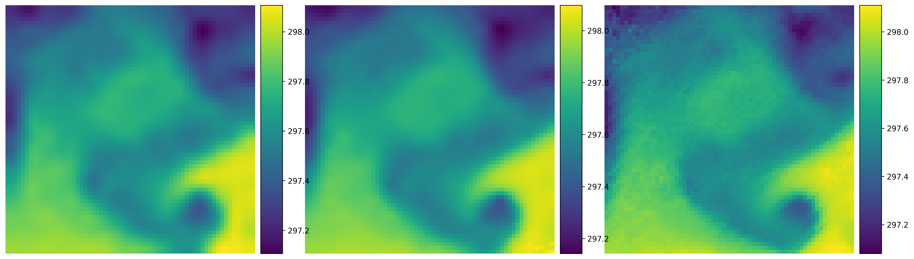
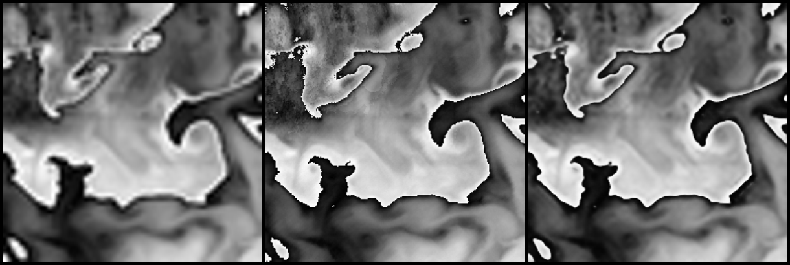
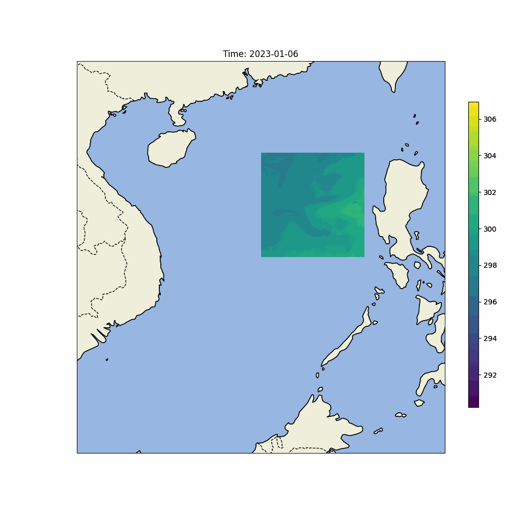
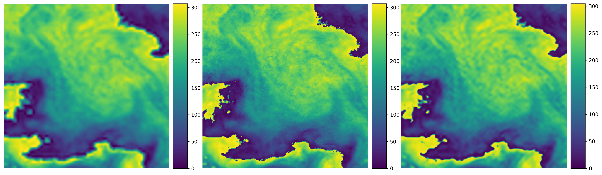
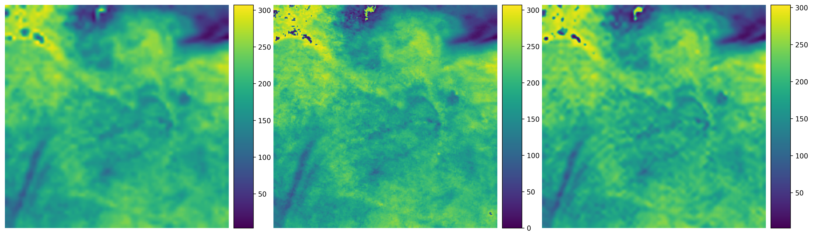

# SRGAN_SST
An adaptation of the PyTorch implementation of SRGAN from https://github.com/leftthomas/SRGAN for Sea Surface Temperature (SST) dataset. Model architecture is based on the CVPR 2017 paper [Photo-Realistic Single Image Super-Resolution Using a Generative Adversarial Network](https://arxiv.org/abs/1609.04802).

## Requirements
- PyTorch
```
conda install pytorch torchvision -c pytorch
```
- opencv
```
conda install opencv
```

## Datasets

### Train、Val Dataset
The train and val datasets are sampled from High-resolution SST data from Himawari satellite and Low-resolution SST data from OSTIA.
Train dataset has 11378 images and Val dataset has 2398 images.
Download the datasets from [here](https://www.ncei.noaa.gov/access/metadata/landing-page/bin/iso?id=gov.noaa.nodc:GHRSST-AHI_H09-STAR-L3C), and then extracts it into `data` directory.
Augmentation consisting of rotation and horizontal flip can also be performed with data_preprocess.py.

### Test Image Dataset
The test image dataset is also sampled from the same source as train and val, with a 70-15-15 split using the data_preprocess.py code (which automatically extracts into `data` directory).

## Usage

### Train
```
python train.py

optional arguments:
--crop_size                   training images crop size [default: 128]
--upscale_factor              super resolution upscale factor [default: 4]
--num_epochs                  train epoch number [default: 100]
--learning_rate               learning rate for generator and discriminator [default: 0.0002]
--b1                          first order momentum of gradient [default: 0.5]
--b2                          second order momentum of gradient [default: 0.999]
--decay_epoch                 start lr decay every decay_epoch epochs [default: 50]
--gamma                       multiplicative factor of learning rate decay [default: 0.1]
```
The output val super resolution images are on `training_results` directory.

### Test Benchmark Datasets
```
python test_benchmark.py

optional arguments:
--upscale_factor              super resolution upscale factor [default value is 4]
--model_name                  generator model epoch name [default value is netG_epoch_4_100.pth]
```
The output super resolution images are on `benchmark_results` directory.

## Benchmarks
**SRGAN (Upscale Factor = 4)**

Epochs with batch size of 128 takes ~4 minute 30 seconds on a NVIDIA GTX 1080Ti GPU.

Left: bicubic interpolation image, Middle: super resolution generated image (output of SRGAN), and Right: high resolution (original) image.

- Australia_64x64_1 (PSNR:33.6378; SSIM:0.9107)



- Australia_64x64_2 (PSNR:33.7581; SSIM:0.8897)



- Australia_Global



**WGAN-GP (Upscale Factor = 4)**

Epochs with batch size of 128 takes ~5 minute 25 seconds on a NVIDIA GTX 1080Ti GPU. 

Left: bicubic interpolation image, Middle: high resolution (original) image, and Right: super resolution generated image (output of WGAN-GP).

- South China Sea_256x256_1 (PSNR:33.7097; SSIM:0.8280)



- South China Sea_256x256_2 (PSNR:36.9008; SSIM:0.7585)



The complete test results could be downloaded from [here](https://github.com/SimonTsh/SRGAN_SST/tree/master/benchmark_results).